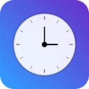

# MenuBar Timer Max



**Transform your productivity with a sleek timer that lives in your menu bar.**

[](https://apps.apple.com/ua/app/menubar-timer-max/id6749057822?mt=12)
[](https://www.apple.com/macos)
[](https://apps.apple.com/ua/app/menubar-timer-max/id6749057822?mt=12)

## Overview

MenuBar Timer Max is the perfect productivity companion for macOS. Set custom timers, get beautiful notifications, and stay focused on what matters — all without leaving your menu bar.

## ✨ Key Features

### 🎯 **Menu Bar Integration**
Always accessible, never intrusive. Your timer lives right where you need it.

### 💾 **Custom Timer Profiles**
Save your favorite timer settings for quick access. Perfect for recurring tasks and routines.

### 🔔 **Beautiful Notifications**
Telegram-style floating alerts that look great and grab your attention at the right moment.

### ⏱️ **Multiple Timer Types**
- **Countdown timers** - Set a specific duration
- **Stopwatch** - Track time as it counts up
- **Presets** - Quick access to your most-used timers

### 🔊 **Custom Sounds**
Choose from 11 built-in alert sounds to match your style and preferences.

### 🎨 **Modern Design**
Clean, intuitive interface that follows macOS design guidelines.

## 🚀 Perfect For

- **Pomodoro Technique** sessions (25 min work + 5 min break)
- **Meeting reminders** - Never miss your next call
- **Break scheduling** - Remind yourself to step away from the screen
- **Task time tracking** - Keep track of how long tasks take
- **Focus sessions** - Deep work without distractions

## 📋 Requirements

- macOS 12.0 or later
- 429.9 KB disk space

## 🌍 Supported Languages

- English
- French
- German
- Polish
- Spanish
- Ukrainian

## 🔒 Privacy

**Data Not Collected** - We don't collect any data from this app. Your privacy is paramount.

For more details, see our [Privacy Policy](https://gerasart.github.io/ios-support/privacy).

## 💎 Pricing

**$3.99 USD** - One-time purchase

- ✅ No subscriptions
- ✅ No ads
- ✅ No in-app purchases
- ✅ Just pure productivity

## 👨‍👩‍👧‍👦 Family Sharing

Up to six family members can use this app with Family Sharing enabled.

## 📥 Download

[](https://apps.apple.com/ua/app/menubar-timer-max/id6749057822?mt=12)

[**Get MenuBar Timer Max on the Mac App Store**](https://apps.apple.com/ua/app/menubar-timer-max/id6749057822?mt=12)

## 🎯 Use Cases

### Pomodoro Technique
```
1. Set a 25-minute timer for focused work
2. Take a 5-minute break when it ends
3. After 4 pomodoros, take a longer 15-30 minute break
```

### Meeting Preparation
```
Set a reminder 5 minutes before your next meeting
Never join late again!
```

### Health & Wellness
```
Set hourly reminders to:
- Stand up and stretch
- Look away from the screen (20-20-20 rule)
- Stay hydrated
```

### Time Tracking
```
Use stopwatch mode to track:
- How long tasks actually take
- Billable hours
- Study sessions
```

## 🎨 Screenshots

*Sleek menu bar integration with beautiful notifications and an intuitive interface.*

## ⭐ Reviews

> "Really cool app, convenient to use for time tracker, looking forward to new features 💪🏼"

## 🛠️ Technical Details

- **Built with:** Native macOS technologies
- **Architecture:** Clean, modern codebase
- **Size:** Only 429.9 KB - incredibly lightweight
- **Performance:** Minimal CPU and memory usage

## 📞 Support

Need help? Have a feature request? Contact us:

- **Email:** gerasymenkoph@gmail.com

## 📄 License

© 2025 Maksim Gerasymenko. All rights reserved.

## 🚀 What's Next?

We're continuously improving MenuBar Timer Max. Stay tuned for:
- More customization options
- Additional sound choices
- New timer types
- Enhanced productivity features

---

**Transform your productivity today. [Download MenuBar Timer Max](https://apps.apple.com/ua/app/menubar-timer-max/id6749057822?mt=12)**
